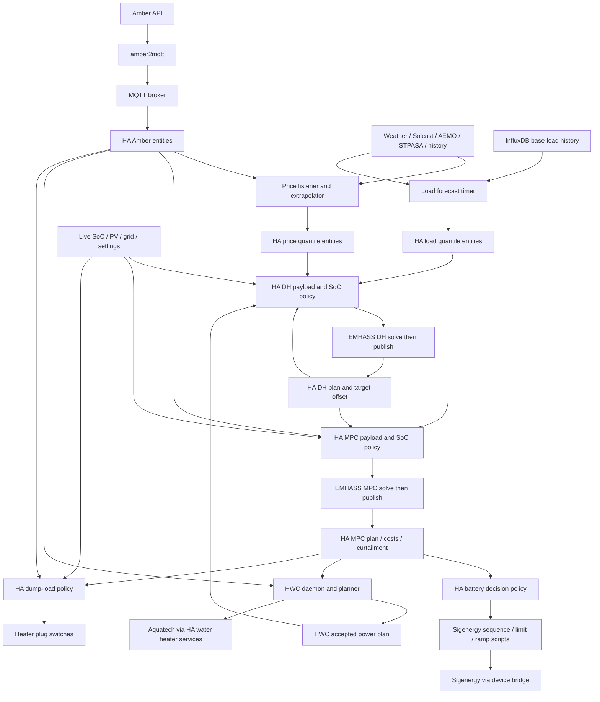

# Energy pipeline runtime inventory

Checked: 2026-10-01 ~22:34–22:38 ACST. Read-only audit; no service/control changes.
Evidence: system/user systemd unit states, `docker ps`, HA `/api/states`, deployed YAML,
price/HWC journals, sibling bridge/HWC source. This is a point-in-time baseline.

## Current dependency and feedback map

Edges show configured consumption, not mandatory reruns on every upstream change.
HWC power is frozen for DH payload construction and used by MPC according to its payload policy.
Feedback includes prior DH SoC/target offsets and HWC plans; model as accepted revisions across
cycles, not a recursive chain that must settle completely before any device command.

## Verified runtime

| Component | Observed state | Role / disposition |
|---|---|---|
| `ai-energy-listener.service` | Running | First resident-worker migration target |
| `ai-energy-hwc-daemon.service` | Running | Retain domain service; explicit revision handshake later |
| `ai-energy-hwc-web.service` | Running | Reporting; keep outside control scheduling |
| Load `ai-energy-predict.timer` | Active | Migrate forecast scheduling after price worker |
| STPASA timer | Active | Independent cached covariate refresh |
| P5MIN/PREDISPATCH/PD7Day/SevenDay timers | Active | Retain ingest/archive jobs initially |
| Training/tariff-update timers | Active | Keep outside real-time coordinator |
| System capture/aggregate timers | Active | Retain until replacement health contracts are verified |
| EMHASS container | Running `v0.17.9` | Retain solver and existing HTTP adapter initially |
| Amber/MQTT/HA containers | Running | Retain ingestion and HA interface initially |
| Sigenergy bridge | Running, healthy | Retain hardware integration |
| InfluxDB | Running `1.12.4` | Retain history/aggregation; make readiness explicit |

One-shot services shown inactive/dead between timer runs are not a failure.

## Active HA ownership

| Entity | HA state | Ownership / migration decision |
|---|---|---|
| `automation.emhass_trigger_on_5min_price_update` | on | Actual DH automation entity despite historical name; move after payload parity |
| `automation.emhass_mpc_optim_on_5min_price_update` | on | MPC solve/publish/control ordering; move as one transaction |
| `automation.battery_ems_control_based_on_emhass_forecasts` | on | Battery policy; retain during forecast/solve extraction |
| `automation.amber_negative_price_dump_loads` | on | Four heater plugs; separate policy/actuator owner |
| `automation.sigen_master_limit_controller` | on | Limit enforcement; retain |
| Sigen export ramp hold/release automations | on | Device transition guards; retain |
| `automation.emhass_update_target_soc_offset` | on | DH feedback; move with accepted-plan state |
| Battery SoC 5/30-minute and full-recording automations | on | Derived/feedback state; audit consumers before removal |
| `automation.battery_ems_control_based_on_amber_prices` | off | Retired alternate writer; removal candidate after consumer audit |
| `automation.update_emhass_statoptim_forecast` | off | Retired alternate path; removal candidate |

Battery policy calls `script.configure_sigen_ems_state`; mode/charge/discharge/PV register writes
live there. Grid/PCS limits live in `script.sigen_apply_limits`, also invoked by limit/ramp
automations. They are cooperating device controllers; preserve their sequencing at first cutover.

HWC daemon calls HA water-heater services; manual Aquatech preset scripts remain defined.
Manual calls/HA UI are intentional additional command entry points and need an explicit override
policy. Dump-load automation owns four switches; circulation-fan automations follow plug state.
This audit covers inspected HA configuration and HWC code; external clients/manual register
writes have not been exhaustively enumerated.

## Observed data and timing

- HA snapshot: APF entity updated `13:00:26.979Z`; p50 price updated `13:00:52.929Z`: ~25.95s.
- Recent nine listener runs: 25.3–28.9s process duration. These are run durations, not upstream
  Amber API publication latency; no model-load/time breakdown measured yet.
- Price/load: 144 half-hour points. MPC battery plan: 168 five-minute points (14h).
  HWC plan: 576 five-minute points (48h).
- Load publication at `13:02:05.678Z`; DH SoC entity publication at `13:02:09.451Z`: ~3.77s.
  This sample does not measure completion of the entire DH publication family.
- HWC journal at 22:30:25 and 22:35:16: confirmed-price event arms latch; MPC cost entity
  publication ~2.1s later requests replan. This handshake is operational.
- HA forecast attributes include `update_time`; AI forecast entities have `last_updated`, but
  inspected attribute keys provide no shared parent revision across a quantile family.
- Local amber2mqtt source publishes state and forecast attributes separately, QoS 0, retained;
  `update_time` uses `datetime.now()`. Local checkout/container source equivalence and live MQTT
  payload grouping not verified. Do not use broker receipt or bridge update time as APF issue time.

## Decisions for first implementation

- Keep HA WebSocket ingress initially; build a normalised snapshot store with content revisions.
- Extract pure payload/time/SoC calculations with recorded-input parity before moving solve triggers.
- Resident price worker loads the three production models once; one price run at a time and one
  pending refresh. Separate cached covariate acquisition from APF-triggered inference.
- Internal completion is a validated quantile bundle; HA entity writes remain external projections.
- Retain existing load scheduling, DH/MPC triggers, EMHASS, HWC and device command owners during
  the first worker migration. Remove the old price listener path when its replacement takes over.
- Direct MQTT ingress/Amber acquisition replacement is a later decision, not a prerequisite.
- Before moving solver ownership: verify installed EMHASS transaction behaviour, stale result
  rejection and DH/MPC shared state; local development checkout is not proof of deployed code.

## Removal order and outstanding verification

1. Price subprocess wrapper replaced after resident-worker publication parity and timing checks.
2. Migrated forecast timers removed only when reconciliation/startup recovery is operational.
3. HA DH/MPC solve automations and payload templates removed after shadow payload parity.
4. Feedback helpers removed with their state owners; dashboards/consumers migrated together.
5. Disabled historical controllers removed after complete consumer/reference audit.

Outstanding before production cutover: model/resource memory baseline; exact input revision
rules; live MQTT grouping; Amber Express active polling/consumers; Influx readiness; complete
actuator/override inventory beyond inspected config; EMHASS result identity; startup recovery;
recorded snapshots and payload replay parity. Runtime routing baseline is complete enough to
start pure-function extraction; these remaining checks are explicit migration gates.
