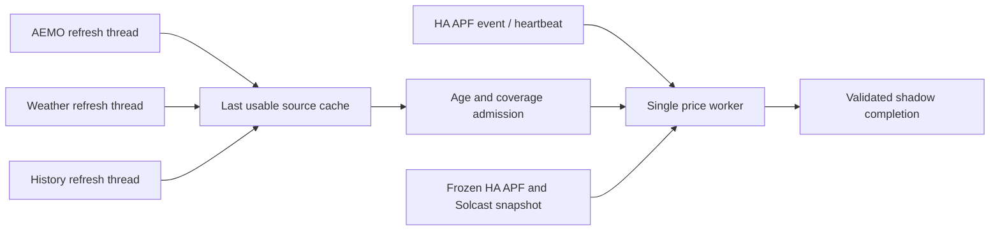

# Resident source caches and memory checkpoint

Status: implemented in calculation-only shadow; production routing unchanged.
Evidence collected 2026-10-01/02 Adelaide. Parent: [resident price worker](energy_pipeline_resident_price.md).

## Routing



- Three independent source threads; one inference thread; single process. Source threads never
  execute inference or publication. Retain one accepted dataframe per source; bounded trigger.
- APF inference uses cached weather/AEMO/history; performs one HA states read for current APF/
  Solcast. No AEMO, weather service or Influx query on this inference path.
- Successful source content change or recovery from expired acquisition age re-arms inference.
  Unchanged refresh advances acquisition time without changing its content revision.
- Failed/invalid refresh preserves prior accepted frame and timestamp; every inference rechecks
  age and current horizon coverage. Missing/expired coverage blocks inference, never falls through
  to synchronous refresh or fabricates a fresh revision.
- Cache snapshots copied under an immutable ownership contract; input revisions/ages in completion.
- Completion lineage also includes opaque config/effective-tariff digests, each frozen Solcast
  entity digest and the installed model artifact signature digest. Signature is path/inode/size/
  mtime identity, not a byte-content checksum; failed promotion retains prior installed identity.
  Digests record consumed inputs; obsolete-result rejection/publication is still unimplemented.
- Config frozen for process lifetime to avoid changing forecast globals while source threads run.
  Config edits require shadow restart; inference detects changes and fails. Tariff maps read per run;
  active model pointer still resolved per run. Legacy globals require one inference worker.
- `PredictionInputs` injection allowed only with `calculation_only=True`; ordinary CLI production
  acquisition/publication unchanged. Prepared future covariates must be finite over full horizon.

## Admission defaults (shadow policy)

| Source | Refresh after completion | Max acquisition age | Coverage |
|---|---:|---:|---|
| AEMO | 5m | 30m | All configured AEMO/STPASA features, 144 × 30m |
| Weather | 30m | 2h | Configured weather features, 144 × 30m |
| History | 5m | 40m | Target/features; latest complete row ≤90m behind; model lag lookback |
| Solcast | Per inference HA snapshot | No separate source age budget yet | PV, 144 × 30m |

- Acquisition age starts before request, including slow fetch time. Provider issue/update age
  remains a separate unverified contract; a new retrieval is not proof of new upstream data.
- Full coverage can expire before acquisition budget, e.g. rolling beyond weather's final interval.
- Sorted unique timezone-aware indexes; reject missing columns, infinity and invalid coverage.
- Model history lag window derives from configured target lags. Existing historical gap fill remains.
- These stricter shadow admissions are not production threshold changes. Need broader operational
  samples before cutover; independent source-issuance and HA-entity freshness still outstanding.

## Confirmed input quirks

- 2026-10-01 23:57: nightly `stpasa_solar_avail_frac` NaNs coincide with available generation = 0
  and solar capacity = 0 (184/184 in acquired AEMO horizon; 226/226 in history). Wind ratios finite.
- Admit undefined ratios only for confirmed 0/0 with some finite ratio elsewhere. Raw NaNs preserved;
  incumbent covariate ffill/bfill unchanged. Positive/missing capacity or wholly missing ratio rejected.
- 2026-10-02 00:00: Solcast's four-day horizon spans Adelaide DST change; mixed UTC offsets give
  pandas an object index. Normalize to UTC before admission, matching incumbent preparation.
- Plain raw `notna()` coverage would reject valid overnight data; explicit exceptions above preserve
  behaviour without permitting arbitrary missing covariates.

## Freshness contract audit (2026-10-02 morning)

- Live Solcast `sensor.solcast_pv_forecast_api_last_polled` state is an aware successful-fetch
  timestamp (23:07:45 UTC at inspection); `last_attempt` and `next_auto_update` are separate attrs.
  Installed `solcast_solar/solcastapi.py:last_updated` and `fetcher.py:get_forecast_update` confirm
  timestamp advancement after all attempted sites succeed and forecast build is attempted.
  Build/serialization can still fail after timestamp assignment; timestamp alone is insufficient.
  Forecast entities have no own provider-issuance attr. Capture poll metadata with arrays before
  defining schedule-aware age policy; overnight polling gaps are intentional.
- Live APF attr `update_time` was `2026-10-01T23:45:17.754096` while HA update was
  `2026-10-01T23:45:17.943092+00:00`. Local amber2mqtt `mqttmessages.py` uses naive
  `datetime.now()`: bridge publication time, not provider issuance. Read-only live
  `docker exec amber2mqtt date` confirmed UTC (+0000), 2026-10-02 morning; local-code/live-image
  equivalence remains unverified. Preserve naive value as evidence, never assume Adelaide.
- Installed BOM `bureau_of_meteorology/PyBoM/collector.py:_fetch_with_retry` can return cached
  hourly forecast data after request failure. Its successful-fetch timestamp stays internal.
  `weather.py:async_forecast_hourly` projects forecast fields without that cache timestamp;
  weather entity state/last_updated also reflects observations. Successful HA service retrieval
  cannot establish a new BOM fetch or provider issue. Need explicit upstream freshness metadata
  or a separate source contract before production admission is trustworthy.

## Freshness provenance implementation

- `energy_pipeline/freshness.py`: frozen evidence records; bounded worker-local ContextVar collector.
  Collection restored after success/failure/nesting; refresh threads cannot mix their evidence.
- AEMO short-term HTTP, NEMWeb listing and ZIP response record requests-cache `created_at`,
  `from_cache`, `is_expired`. Expired/stale-if-error responses retain original creation time;
  cached response with unknown time remains unknown. Legacy naive requests-cache dates are UTC.
  HTTP response creation is successful retrieval time, NOT report/provider issuance time.
- STPASA records latest run_time in the loaded target window. Diagnostic inventory marker, not
  the oldest consumed row's age or proof every row meets freshness requirements.
- `AcquiredSource` bundles frame + immutable evidence; cache copies/preserves evidence with frame.
  Invalid/failed refresh retains prior frame, evidence and acquisition time. Content digest unchanged.
- Completion logs evidence for weather/AEMO/history and frozen HA APF/Solcast snapshot. BOM
  provider fetch explicitly unknown; Amber HA update and naive bridge publication separate.
- Optional `home_assistant.solcast_last_polled_entity` joins the SAME HA states response and input
  digest; no extra inference-path network call. Integration poll state is a fetch marker with build/
  serialisation caveat above; absent marker remains unknown. Config still requires process restart.
- Evidence diagnostic only: no source-age threshold, production admission, alerting or bridge change.
  Next admission policy must distinguish transport receipt, provider issuance, observation time and
  consumed coverage; do not turn retrieval success into fresh-provider proof.
- Live finite probe 2026-10-02 10:14 Adelaide: all quantiles 144 points, no publication, exit 0.
  9.8s cold / RSS 1127 MiB, three model loads. Short-term response uncached; NEMWeb listing/report
  cached with original ~00:40 UTC response dates; Solcast marker 00:30:55 UTC; BOM unknown.
  STPASA run-window markers distinct for history/forecast, confirming they cannot be used as a
  single universal freshness clock. Config now names the confirmed Solcast poll entity; incumbent
  ignores this extra field, no running service restarted. Freshness evidence logs no credentials.

## Memory evidence and handling

- Frozen-source repeat probe + GC: six warm inferences; RSS ~1491 MiB, Python traced net growth
  ~0.17 MiB. Supports transient/acquisition/native allocator retention as contributor; not proof
  that all long-running allocations are bounded.
- Recorded source replay: eight runs; 14.7s cold, 3.9–4.5s warm; RSS ~991–992 MiB.
- Live threaded acquisition + eight cached runs: 9.7s cold inference, 3.7–4.2s warm; RSS
  1892 →1900 MiB then stable. Bootstrap fetch time measured separately (~21s).
- First event-loop session exceeded unchanged 2048 MiB post-run guard at 2180 MiB and exited.
- Allocator diagnostic: trimming unused native heap reduced 1814 →1391 MiB; later run 1403 →1396.
- `energy_pipeline/memory.py`: GC after each inference; above 1536 MiB attempt optional GNU
  `malloc_trim(0)`; measure before/after RSS and maintenance time. The function releases unused heap
  pages across arenas and is documented thread-safe: [Linux manual](https://www.man7.org/linux/man-pages/man3/malloc_trim.3.html).
- Missing GNU extension: skip trim; existing 2048 MiB guard remains. Not an OS peak-memory cap.
- Final six-minute event-loop session completed and stopped automatically (exit 0): HA WebSocket
  authenticated/subscribed; startup generation, real APF update, then independent history/AEMO refresh.
  APF inference 4.6s with cached dependencies; changed AEMO frame triggered another solve in 2.2s
  using the same APF revision. Three shadow completions; three model loads total; no publications.
- Memory in that session: bootstrap 1985 →1377 MiB; APF run ~1395 MiB; after next source refresh
  2055 →1590 MiB. Maintenance 0.15–0.17s; unchanged 2048 MiB post-maintenance guard respected.
  Higher steady RSS after source refresh means a longer multi-cycle/daytime run remains necessary.
- 2026-10-02 09:03–09:19 Adelaide: 16-minute daytime event shadow, exit 0; six completions,
  three model loads total. Cold 9.6s; APF runs 4.4–5.5s; source-change replans 2.0–2.2s.
  Bootstrap plus two completed AEMO/history refresh cycles; third acquisition was in flight at
  automatic shutdown and discarded. No publications. This session used the preceding commit;
  new lineage fields validated by the focused suite, not by this running process.
  Post-maintenance RSS ~1698 →1840 →1995 MiB across source cycles, then ~1992 MiB on APF run;
  pre-maintenance peak measured at 2290 MiB. No guard breach, but continuing growth leaves little
  headroom: memory stability gate NOT passed. Do not raise the guard or proceed to cutover.
  Next isolate repeated AEMO vs history acquisition with stable inference and measure Python/native
  retention per thread/source. No upstream failure/reconnect injected in this session.

## Archive-read correction (2026-10-02 morning)

- Isolated five AEMO/history refresh pairs without models: RSS after GC + forced libc trim
  ~102 MiB baseline, 531 MiB first AEMO, 613 MiB first history, 861 MiB final. Accepted frames
  only 0.056/0.111 MiB. Growth exists without inference or retained forecast results.
- Both source paths loaded the entire STPASA parquet on every refresh: 159 MiB compressed,
  4,011,552 rows. Large transient archive expansion/feature grouping drives substantial retention;
  exact allocator attribution is not proven (installed Arrow pool uses mimalloc; libc trim does
  not establish that its pages were reclaimed).
- `forecast.py:_load_stpasa_regionsolution(targets=...)`: parquet interval_dt range predicate
  limits materialization/grouping to requested target window. Keep ALL run_time revisions in
  that range; existing per-target as-of selection unchanged, including historical no-lookahead.
  Both historical and future feature callers pass their target indexes. Empty targets skip read.
  Shared acquisition code benefits incumbent CLI on its next run too; no unit/ownership changes.
- Frozen copy of live archive: exact feature equality between full and filtered reads for
  480 historical half-hours and 373 future half-hours, all feature columns/NaNs. Filtered rows
  69,120 history / 28,656 future. Test also covers multiple revisions, future-issued rows and DST.
- Five filtered source pairs: forced-trim RSS 198 →293 MiB; AEMO ~2.0–2.5s vs ~8s,
  history ~2.6–3.0s vs ~8s. Reduced growth, not proof of zero retained growth.
- Six concurrent refresh → inference cycles, production maintenance policy unchanged: RSS
  1164, 1162, 1192, 1218, 1221, 1232 MiB; all below trim threshold, no allocator trim required.
  Three model loads total; cold 13.5s, warm 4.3–5.1s. Full new input-lineage keys present.
  Calculation only, no publication. RSS still rises ~68 MiB: longer normal event-loop validation
  remains necessary before accepting long-run memory stability. No guard/threshold relaxation.
- Focused suite including STPASA feature tests: 79 pass. Scratch probes under /tmp, no household
  archive or raw frames committed. Temporary frozen parquet removed after parity comparison.

## Longer filtered shadow (2026-10-02 09:39–09:59 Adelaide)

- 20-minute normal event/WebSocket shadow, calculation only, automatic exit 0. Eight completions:
  startup, four real APF events and three AEMO refresh-triggered replans; three model loads total.
- Source bootstrap plus three completed normal AEMO/history refresh cycles. History content
  unchanged; successful refresh advances acquisition age without re-arming work.
- Post-maintenance RSS MiB: 1125, 1133, 1207, 1209, 1224, 1233, 1248, 1248. No heap trim used;
  unchanged 2048 MiB guard respected. Far more headroom than unfiltered run, but still upward
  drift: multi-hour/full-day stability gate remains unpassed.
- Cold inference 10.4s; real APF runs 4.5–5.7s; source-change runs 2.1–4.0s. Source refresh
  4.8–5.7s under concurrent acquisition. No upstream failures/reconnects injected; this session
  does not span a 30-minute boundary or weather refresh. Those remain separate validation gates.
- Session ran archive-filter commit before freshness changes; new metadata verified separately
  by finite probe above. No production sensors/files/health/controls/unit ownership changed.

## Commands

```bash
.venv/bin/python services/resident_price.py --runs 8
.venv/bin/python services/resident_price.py --runs 2 --verify-reload
.venv/bin/python services/resident_price.py --duration 360
.venv/bin/python -m pytest tests/energy_pipeline tests/unit/test_forecast_hardening.py tests/unit/test_production_contract.py tests/unit/test_ha_listener.py tests/unit/test_model_bundles.py -q
```

- `--runs`: warm sources once, then finite cached inference benchmark.
- `--duration`: normal WebSocket/source loops, automatic shutdown; mutually exclusive with `--runs`.
- Source/price thread timeout 180s stops scheduler; no late cache commit or result acceptance.
- No production sensor, forecast file, control state, health record, service unit or enabled daemon changed.

## Resume checkpoint

- Implemented/tested: independent cache refresh, strict admission, confirmed zero-capacity exceptions,
  UTC Solcast normalization, no-acquisition inference path, content lineage, memory reclamation.
- Cached/reloaded quantile parity passes on admitted cached inputs; all quantiles 144 points.
- Focused suite: 86 checks; cache failure/staleness/rollover/DST/isolation, slow refresh with usable
  cache, deadline discard, memory guard/reclamation, cached HTTP timestamps, collector isolation,
  real response-path evidence, incumbent regressions.
- Still shadow only. Short benchmark evidence is not a full-day memory/failure-recovery gate.
- Next: multi-hour filtered shadow and source failures/reconnect/
  interval/DST boundaries; expose trustworthy source freshness metadata and test result rejection.
- Then implement result acceptance/publication transaction and switch price ownership with explicit
  rollback/single-writer checks. DH/MPC solve/control ownership stays in HA until its own shadow gate.
