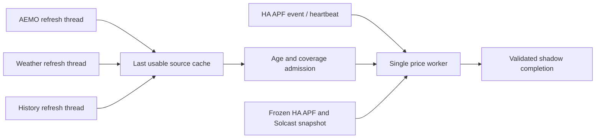

# Resident source caches and memory checkpoint

Status: implemented in calculation-only shadow; production routing unchanged.
Evidence collected 2026-10-01/02 Adelaide. Parent: [resident price worker](energy_pipeline_resident_price.md).

## Routing



- Three independent source threads; one inference thread; single process. Source threads never
  execute inference or publication. Retain one accepted dataframe per source; bounded trigger.
- APF inference uses cached weather/AEMO/history; performs one HA states read for current APF/
  Solcast. No AEMO, weather service or Influx query on this inference path.
- Successful source content change or recovery from expired acquisition age re-arms inference.
  Unchanged refresh advances acquisition time without changing its content revision.
- Failed/invalid refresh preserves prior accepted frame and timestamp; every inference rechecks
  age and current horizon coverage. Missing/expired coverage blocks inference, never falls through
  to synchronous refresh or fabricates a fresh revision.
- Cache snapshots copied under an immutable ownership contract; input revisions/ages in completion.
- Config frozen for process lifetime to avoid changing forecast globals while source threads run.
  Config edits require shadow restart; inference detects changes and fails. Tariff maps read per run;
  active model pointer still resolved per run. Legacy globals require one inference worker.
- `PredictionInputs` injection allowed only with `calculation_only=True`; ordinary CLI production
  acquisition/publication unchanged. Prepared future covariates must be finite over full horizon.

## Admission defaults (shadow policy)

| Source | Refresh after completion | Max acquisition age | Coverage |
|---|---:|---:|---|
| AEMO | 5m | 30m | All configured AEMO/STPASA features, 144 × 30m |
| Weather | 30m | 2h | Configured weather features, 144 × 30m |
| History | 5m | 40m | Target/features; latest complete row ≤90m behind; model lag lookback |
| Solcast | Per inference HA snapshot | No separate source age budget yet | PV, 144 × 30m |

- Acquisition age starts before request, including slow fetch time. Provider issue/update age
  remains a separate unverified contract; a new retrieval is not proof of new upstream data.
- Full coverage can expire before acquisition budget, e.g. rolling beyond weather's final interval.
- Sorted unique timezone-aware indexes; reject missing columns, infinity and invalid coverage.
- Model history lag window derives from configured target lags. Existing historical gap fill remains.
- These stricter shadow admissions are not production threshold changes. Need broader operational
  samples before cutover; independent source-issuance and HA-entity freshness still outstanding.

## Confirmed input quirks

- 2026-10-01 23:57: nightly `stpasa_solar_avail_frac` NaNs coincide with available generation = 0
  and solar capacity = 0 (184/184 in acquired AEMO horizon; 226/226 in history). Wind ratios finite.
- Admit undefined ratios only for confirmed 0/0 with some finite ratio elsewhere. Raw NaNs preserved;
  incumbent covariate ffill/bfill unchanged. Positive/missing capacity or wholly missing ratio rejected.
- 2026-10-02 00:00: Solcast's four-day horizon spans Adelaide DST change; mixed UTC offsets give
  pandas an object index. Normalize to UTC before admission, matching incumbent preparation.
- Plain raw `notna()` coverage would reject valid overnight data; explicit exceptions above preserve
  behaviour without permitting arbitrary missing covariates.

## Memory evidence and handling

- Frozen-source repeat probe + GC: six warm inferences; RSS ~1491 MiB, Python traced net growth
  ~0.17 MiB. Supports transient/acquisition/native allocator retention as contributor; not proof
  that all long-running allocations are bounded.
- Recorded source replay: eight runs; 14.7s cold, 3.9–4.5s warm; RSS ~991–992 MiB.
- Live threaded acquisition + eight cached runs: 9.7s cold inference, 3.7–4.2s warm; RSS
  1892 →1900 MiB then stable. Bootstrap fetch time measured separately (~21s).
- First event-loop session exceeded unchanged 2048 MiB post-run guard at 2180 MiB and exited.
- Allocator diagnostic: trimming unused native heap reduced 1814 →1391 MiB; later run 1403 →1396.
- `energy_pipeline/memory.py`: GC after each inference; above 1536 MiB attempt optional GNU
  `malloc_trim(0)`; measure before/after RSS and maintenance time. The function releases unused heap
  pages across arenas and is documented thread-safe: [Linux manual](https://www.man7.org/linux/man-pages/man3/malloc_trim.3.html).
- Missing GNU extension: skip trim; existing 2048 MiB guard remains. Not an OS peak-memory cap.
- Final six-minute event-loop session completed and stopped automatically (exit 0): HA WebSocket
  authenticated/subscribed; startup generation, real APF update, then independent history/AEMO refresh.
  APF inference 4.6s with cached dependencies; changed AEMO frame triggered another solve in 2.2s
  using the same APF revision. Three shadow completions; three model loads total; no publications.
- Memory in that session: bootstrap 1985 →1377 MiB; APF run ~1395 MiB; after next source refresh
  2055 →1590 MiB. Maintenance 0.15–0.17s; unchanged 2048 MiB post-maintenance guard respected.
  Higher steady RSS after source refresh means a longer multi-cycle/daytime run remains necessary.

## Commands

```bash
.venv/bin/python services/resident_price.py --runs 8
.venv/bin/python services/resident_price.py --runs 2 --verify-reload
.venv/bin/python services/resident_price.py --duration 360
.venv/bin/python -m pytest tests/energy_pipeline tests/unit/test_forecast_hardening.py tests/unit/test_production_contract.py tests/unit/test_ha_listener.py tests/unit/test_model_bundles.py -q
```

- `--runs`: warm sources once, then finite cached inference benchmark.
- `--duration`: normal WebSocket/source loops, automatic shutdown; mutually exclusive with `--runs`.
- Source/price thread timeout 180s stops scheduler; no late cache commit or result acceptance.
- No production sensor, forecast file, control state, health record, service unit or enabled daemon changed.

## Resume checkpoint

- Implemented/tested: independent cache refresh, strict admission, confirmed zero-capacity exceptions,
  UTC Solcast normalization, no-acquisition inference path, content lineage, memory reclamation.
- Cached/reloaded quantile parity passes on admitted cached inputs; all quantiles 144 points.
- Focused suite: 74 checks; cache failure/staleness/rollover/DST/isolation, slow refresh with usable
  cache, deadline discard, memory guard/reclamation, incumbent regressions.
- Still shadow only. Short benchmark evidence is not a full-day memory/failure-recovery gate.
- Next: longer bounded shadow over source failures/reconnect/interval/DST boundaries; verify source
  issuance and entity freshness, extend complete lineage to config/tariff/model inputs.
- Then implement result acceptance/publication transaction and switch price ownership with explicit
  rollback/single-writer checks. DH/MPC solve/control ownership stays in HA until its own shadow gate.
